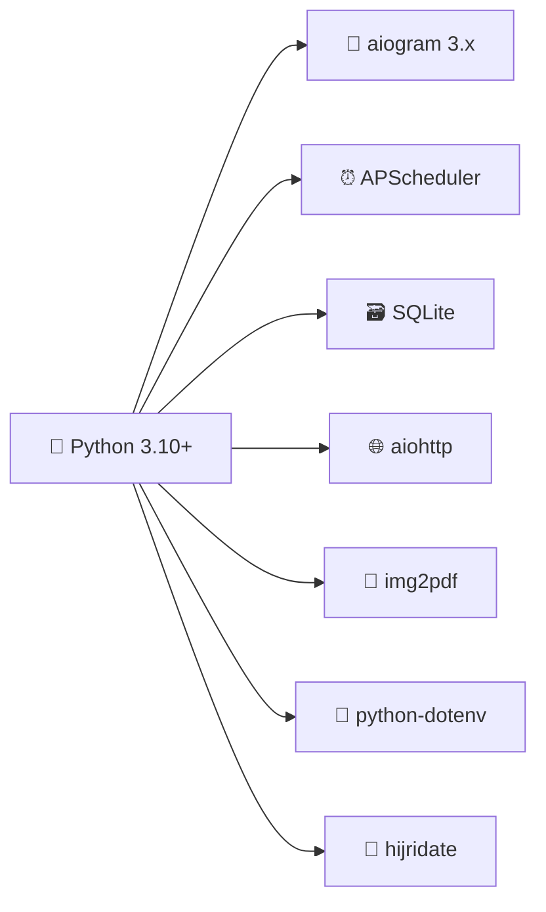

# 🌙 وَرْد — رفيقك الذكي للمحافظة على وردك اليومي من القرآن الكريم

<div align="center">

```
  _____                    _
 / ____|                  | |
| |     _ __ _____      __| | _____   __
| |    | '__/ _ \ \ /\ / /| |/ _ \ \ / /
| |____| | | (_) \ V  V / | | (_) \ V /
 \_____|_|  \___/ \_/\_/  |_|\___/ \_/
```

[](https://www.python.org/)
[](https://docs.aiogram.dev/)
[](https://www.sqlite.org/)
[](LICENSE)
[](https://github.com/0Ahmad0/quran_tele)

**بوت تيليجرام احترافي يُرسل لك وردك اليومي من القرآن الكريم تلقائيًا** ⏰📖

</div>

---

## ✨ لمحة عن المشروع

> في زحمة الحياة وكثرة المشاغل، قد ننسى وردنا أو نؤجله... فجاء هذا البوت ليكون **تذكيرًا لطيفًا** و**رفيقًا ثابتًا** يعينك على الاستمرار مع كتاب الله.

**وَرْد** ليس مجرد بوت — إنه **مُعينٌ على الثبات** مع كتاب الله تعالى، يُرسل لك صفحاتك اليومية في الوقت الذي تختاره، ويتتبع تقدمك حتى إتمام الختمة.

---

## 🚀 المميزات

<table>
<tr>
<td>

### 📖 إرسال تلقائي يومي
يصلك وردك في الوقت الذي تحدده دون أي تدخل يدوي

</td>
<td>

### ⏰ جدولة مرنة
حدد الوقت المناسب لك — صباحًا أو مساءً — والبوت يتكفل بالباقي

</td>
</tr>
<tr>
<td>

### 🔢 ورد يناسبك
اختر عدد الصفحات اليومية حسب طاقتك: صفحة واحدة أو أكثر

</td>
<td>

### 📍 متابعة ذكية للختمة
البوت يعرف آخر صفحة وصلت إليها ويكمل منها مباشرة

</td>
</tr>
<tr>
<td>

### 🖼 صور واضحة للصفحات
صفحات المصحف بجودة عالية للقراءة المريحة من داخل تيليجرام

</td>
<td>

### 📄 تحويل تلقائي لـ PDF
إذا كان الورد أكثر من 10 صفحات، يتم تجهيزه كملف PDF مرتب

</td>
</tr>
<tr>
<td>

### 🤲 أذكار وأدعية
احصل على دعاء مأثور أو ذكر في أي وقت بضغطة زر

</td>
<td>

### 🎉 تهنئة عند الختم
عند إتمام الختمة، يُهنئك البوت ويبدأ ختمة جديدة

</td>
</tr>
<tr>
<td>

### 🌐 دعم اللغتين
واجهة عربية وإنجليزية — اختر ما يناسبك

</td>
<td>

### 👑 لوحة تحكم للمدير
إحصائيات، بث عام، وإدارة المشتركين

</td>
</tr>
<tr>
<td>

### 📝 وضع النص فقط
خيار لإرسال معلومات الجزء والصفحات كنص فقط بدون صور

</td>
<td>

### 🔄 معايرة ذكية
تقديم أو تأخير الصفحة بورد يوم كامل للمعايرة

</td>
</tr>
<tr>
<td>

### 👥 دعم المجموعات
يعمل في المجموعات مع صلاحيات المشرفين

</td>
<td>

### 📊 تتبع الختمات
عداد ختمات فردي وإحصائيات عامة للقراء

</td>
</tr>
<tr>
<td>

### 🗓 تاريخ هجري وميلادي
عرض التاريخ الهجري والميلادي في كل ورد

</td>
<td>

### ⏸ إيقاف واستئناف
تحكم كامل في الإرسال المؤقت

</td>
</tr>
</table>

---

## 🛠 التقنيات المستخدمة



| التقنية | الوصف |
|---------|-------|
| **Python 3.10+** | لغة البرمجة الأساسية |
| **aiogram 3.x** | مكتبة تيليجرام غير المتزامنة |
| **APScheduler** | جدولة المهام وإرسال الورد اليومي |
| **SQLite** | قاعدة بيانات خفيفة لتخزين إعدادات المستخدمين |
| **aiohttp** | جلب صفحات المصحف من الإنترنت |
| **img2pdf** | تحويل صور الصفحات إلى ملف PDF |
| **python-dotenv** | إدارة المتغيرات البيئية بأمان |
| **hijridate** | تحويل التاريخ الميلادي إلى هجري |

---

## 📂 هيكل المشروع

```
quran_tele/
│
├── 📄 main.py              # نقطة البداية — معالجات أوامر البوت والجدولة
├── 📄 database.py          # مدير قاعدة بيانات SQLite
├── 📄 utils.py             # منطق الصفحات، توليد PDF، والأدعية
├── 📄 requirements.txt     # اعتماديات Python
├── 📄 .env.example         # مثال على المتغيرات البيئية
├── 📄 .gitignore           # الملفات المستبعدة من Git
└── 📄 README.md            # هذا الملف
```

---

## 🔐 الأمان أولاً

> ⚠️ **لا تضع التوكن في الكود أبدًا!**

يقرأ المشروع الأسرار من ملف `.env`:

```env
BOT_TOKEN=your_telegram_bot_token
ADMIN_ID=your_telegram_user_id
TIMEZONE=Africa/Cairo
```

إذا تم تسريب التوكن الخاص بك، قم بإلغائه فورًا من [@BotFather](https://t.me/BotFather) وتوليد توكن جديد.

---

## 🚀 التثبيت المحلي

### 1️⃣ استنساخ المستودع

```bash
git clone https://github.com/0Ahmad0/quran_tele.git
cd quran_tele
```

### 2️⃣ إنشاء بيئة افتراضية

```bash
python -m venv .venv
```

<details>
<summary><b>تفعيل البيئة — Windows</b></summary>

```powershell
.venv\Scripts\activate
```
</details>

<details>
<summary><b>تفعيل البيئة — Linux / macOS</b></summary>

```bash
source .venv/bin/activate
```
</details>

### 3️⃣ تثبيت الاعتماديات

```bash
pip install -r requirements.txt
```

### 4️⃣ إعداد ملف البيئة

```bash
# Linux / macOS
cp .env.example .env

# Windows PowerShell
Copy-Item .env.example .env
```

ثم عدّل ملف `.env` ببياناتك:

```env
BOT_TOKEN=put_your_new_bot_token_here
ADMIN_ID=123456789
TIMEZONE=Africa/Cairo
```

### 5️⃣ تشغيل البوت

```bash
python main.py
```

> ✅ عند التشغيل بنجاح، سيظهر لك: `Quran bot started`

---

## 📱 أوامر المستخدم

| الأمر | الوصف |
|-------|-------|
| `/start` | الاشتراك أو إعادة التفعيل |
| `/help` | عرض المساعدة |
| `/status` | عرض إعداداتك الحالية |
| `/goal 5` | ضبط عدد صفحات الورد اليومي (1-604) |
| `/time 08:00` | ضبط وقت الإرسال بنظام 24 ساعة |
| `/page 25` | ضبط الصفحة الحالية (1-604) |
| `/khatma 3` | ضبط رقم الختمة الحالية |
| `/send_now` | إرسال الورد الآن |
| `/azkar` أو `/dua` | ذكر أو دعاء الآن |
| `/pause` | إيقاف مؤقت |
| `/resume` | استئناف الإرسال |

### الأزرار التفاعلية

البوت يوفر واجهة أزرار كاملة لا تحتاج لحفظ الأوامر:

- 📖 **إرسال الورد الآن** — يرسل ورد اليوم فورًا
- 🤲 **ذكر/دعاء الآن** — يرسل دعاء مأثور
- 📌 **إعداداتي** — عرض الحالة والإعدادات
- ⏰ **ضبط وقت الإرسال** — تحديد وقت الإرسال اليومي
- 🔢 **ضبط عدد الصفحات** — تحديد عدد الصفحات اليومية
- 📍 **ضبط الصفحة الحالية** — تحديد صفحة البداية
- ⏸ **إيقاف مؤقت** / ▶️ **استئناف** — التحكم بالإرسال
- 🌐 **تغيير اللغة** — التبديل بين العربية والإنجليزية
- 🔢 **تعيين الختمة** — ضبط رقم الختمة
- 🧪 **معاينة الورد** — تجربة الورد قبل وقته
- ⚙️ **معايرة** — تقديم/تأخير الصفحة بورد كامل
- 🖼 **نوع الإرسال** — اختيار (صور+PDF) أو (نص فقط)

---

## 👑 أوامر المدير

> 🔒 متاحة فقط لحساب `ADMIN_ID`

| الأمر | الوصف |
|-------|-------|
| `/admin_stats` | عرض إحصائيات: عدد المشتركين، الختمات المكتملة، قراء الختمة |
| `/broadcast الرسالة` | إرسال رسالة لجميع المشتركين النشطين |
| `/admin_send_dua` | إرسال دعاء مأثور لجميع المشتركين |
| `/set_khatma_count <id> <num>` | ضبط رقم الختمة لمستخدم معين |
| `/download_db` | سحب نسخة من قاعدة البيانات (SQLite) |

### مميزات لوحة المدير

- 📊 **إحصائيات شاملة**: عدد المشتركين النشطين، إجمالي الختمات، إجمالي قراء الختمة
- 📢 **بث عام**: إرسال رسائل مخصصة للمشتركين
- 🤲 **تعميم الأدعية**: إرسال أدعية مأثورة للجميع
- 👤 **إدارة المستخدمين**: ضبط إعدادات المستخدمين فرديًا

### أزرار المدير التفاعلية

- 📊 **إحصائيات** — عرض إحصائيات شاملة
- 📢 **تعميم** — إرسال بث عام (يتطلب كتابة الرسالة)
- 🤲 **إرسال دعاء للجميع** — إرسال دعاء مأثور للجميع
- 🧪 **معاينة الورد** — معاينة كيف سيبدو الورد
- ⚙️ **معايرة** — معايرة الصفحة الحالية

---

## ⚙️ المميزات التفاعلية الكاملة

### 🧪 معاينة الورد (Preview)
- تجربة الورد قبل وقت الإرسال
- يظهر علامة [معاينة] على الرسالة
- لا يؤثر على موعد الإرسال التالي
- مفيد لاختبار الإعدادات

### ⚙️ المعايرة (Calibration)
- ⏩ **سبق يوم**: تقديم الصفحة بورد كامل (page + daily_goal)
- ⏪ **قصر يوم**: تأخير الصفحة بورد كامل (page - daily_goal)
- مفيد عند:
  - تفويت أيام من القراءة
  - الرغبة في التقديم أو التأخير
  - تصحيح الأخطاء

### 🖼 نوع الإرسال (Send Type)
- 📷 **مع صور**: إرسال الصفحات كصور أو PDF (الافتراضي)
- 📝 **نص فقط**: إرسال معلومات الجزء والصفحات كنص فقط
- مناسب لـ:
  - توفير البيانات
  - السرعة في الإرسال
  - المراجعة السريعة

### ⏸ الإيقاف المؤقت (Pause)
- إيقاف الإرسال التلقائي مؤقتًا
- الإعدادات تبقى محفوظة
- مناسب عند:
  - السفر
  - المرض
  - الانشغال المؤقت

### ▶️ الاستئناف (Resume)
- استئناف الإرسال التلقائي
- مسح تاريخ آخر إرسال لضمان الإرسال
- يعود البوت للعمل كالمعتاد

### 🔢 تعيين الختمة (Set Khatma)
- ضبط رقم الختمة الحالية
- يبدأ من 1 ويمكن الوصول لأي رقم
- يظهر في كل ورد: "الختمة رقم: X"
- مفيد لمتابعة الختمات المتعددة

---

## ☁️ الاستضافة المجانية

### المنصات المتاحة

| المنصة | المميزات | العيوب |
|--------|----------|--------|
| **Render** | سهل، health check | قد ينام، يحذف SQLite |
| **Koyeb** | دائم التشغيل | محدود شهريًا |
| **Railway** | 5$ رصيد مجاني | محدود زمنيًا |
| **VPS مجاني** | تحكم كامل | يحتاج خبرة |

### Render Free

**المميزات:**
- ✅ مجاني تمامًا
- ✅ health check مدمج
- ✅ easy deployment
- ✅ logs واضحة

**العيوب:**
- ⚠️ ينام بعد 15 دقيقة من الخمول
- ⚠️ يستيقظ عند أول request
- ⚠️ SQLite قد تُحذف

**الحل:**
```
استخدم UptimeRobot لمراقبة /health كل 5 دقائق
```

### Koyeb Free

**المميزات:**
- ✅ دائمًا يعمل
- ✅ لا ينام
- ✅ دعم Docker

**العيوب:**
- ⚠️ محدود بـ $5 شهريًا مجانًا
- ⚠️ SQLite قد لا تدوم

### نصيحة لل_production

للعمل الجاد长期使用:
```
✅ استخدم PostgreSQL خارجي (Supabase/Neon)
✅ أو VPS مدفوع ($5/شهر)
✅ أو Render Paid ($7/شهر)
```

---

## ⚠️ الأخطاء الشائعة والحلول

### 1. البوت لا يرد

**الأسباب المحتملة:**
- ❌ التوكن خطأ
- ❌ البوت غير مشغّل
- ❌ المستخدم حظر البوت

**الحل:**
```powershell
# تحقق من التوكن
Test-Path .env

# تحقق من logs
python main.py

# تحقق من حالة المستخدم
/admin_stats
```

### 2. ModuleNotFoundError

**الخطأ:**
```
ModuleNotFoundError: No module named 'aiogram'
```

**الحل:**
```powershell
pip install -r requirements.txt
```

### 3. Missing BOT_TOKEN

**الخطأ:**
```
RuntimeError: Missing BOT_TOKEN
```

**الحل:**
```powershell
# تأكد من وجود .env
Test-Path .env

# أو أضف المتغير للبيئة
$env:BOT_TOKEN="your_token"
```

### 4. SQLite تُحذف على Render

**المشكلة:**
بعد إعادة التشغيل، الداتابيز تختفي

**الحل:**
```
✅ استخدم PostgreSQL خارجي
✅ أو احفظ نسخة احتياطية دائمًا
✅ أو استخدم منصة لا تحذف الملفات
```

### 5. البوت يرسل مرتين في نفس اليوم

**السبب:**
`last_sent_date` لا يتم تحديثها

**الحل:**
```python
# في database.py
db.update_settings(user_id, last_sent_date=today)
```

### 6. أوامر المدير لا تعمل

**السبب:**
`ADMIN_ID` خطأ

**الحل:**
```
1. افتح @userinfobot
2. أرسل /start
3. انسخ الرقم الطويل
4. ضعه في ADMIN_ID
```

### 7. البوت لا يرسل في الوقت المحدد

**الأسباب:**
- ⏰ TIMEZONE خطأ
- ⏰ الوقت بصيغة خاطئة
- ⏰ البوت متوقف

**الحل:**
```powershell
# تحقق من TIMEZONE
cat .env | grep TIMEZONE

# يجب أن يكون: Africa/Cairo أو Asia/Riyadh

# أعد تشغيل البوت
python main.py
```

### 8. TelegramForbiddenError

**الخطأ:**
```
TelegramForbiddenError: bot was blocked by the user
```

**الحل:**
```python
# البوت يحذف المستخدم تلقائيًا
# في logs ستجد:
# "User XXX blocked the bot. Deactivating user."
```

### 9. PDF لا يُرسل

**الأسباب:**
- ❌ مكتبة img2pdf غير مثبتة
- ❌ مسار tmp/ غير موجود

**الحل:**
```powershell
pip install img2pdf
New-Item -ItemType Directory -Path tmp -Force
```

### 10. الصور لا تظهر

**الأسباب:**
- ❌ رابط GitHub raw معطل
- ❌ مشكلة في الإنترنت

**الحل:**
```
تأكد من:
https://raw.githubusercontent.com/maknon/Quran/main/pages-hafs/1.png
```

---

## 🛠️ أدوات التشخيص

### `/status` - للمستخدم
يعرض:
- ✅ الحالة (نشط/متوقف)
- ✅ الإعداد (مكتمل/غير مكتمل)
- ✅ رقم الختمة
- ✅ الورد اليومي
- ✅ الصفحة الحالية
- ✅ وقت الإرسال
- ✅ نوع الإرسال

### `/admin_stats` - للمدير
يعرض:
- 📊 عدد المشتركين النشطين
- 📊 إجمالي الختمات المكتملة
- 📊 إجمالي قراء الختمة

### Logs
```python
logging.basicConfig(level=logging.INFO)
```

**راقب:**
- ✅ "Quran bot started"
- ✅ "Sending daily Quran to X users"
- ⚠️ "User XXX blocked the bot"
- ❌ أي استثناءات

```
┌─────────────────────────────────────────────┐
│  كل 20 ثانية                                 │
│  ┌───────────────────────────────────────┐  │
│  │ هل حان وقت الإرسال لهذا المستخدم؟     │  │
│  │ ───────────────────────────────────── │  │
│  │ ✅ نعم ← إرسال الورد                  │  │
│  │ ❌ لا  ← تخطي                         │  │
│  └───────────────────────────────────────┘  │
└─────────────────────────────────────────────┘
```

البوت يفحص كل 20 ثانية المستخدمين الذين يحين وقت إرسالهم حسب `TIMEZONE` المحدد.

---

## 📖 منطق حساب الصفحات

```
المصحف = 604 صفحة
الأجزاء = 30 جزءًا

البداية ← من current_page
الإرسال ← daily_goal صفحة

تحديد الجزء ← بناءً على الصفحة الأولى من الورد

إذا كانت الصفحات المتبقية ≤ (daily_goal × 1.5)
    ← إرسال كل الصفحات المتبقية (نهاية الختمة)
    ← تهنئة المستخدم بختم القرآن
    ← إعادة تعيين الصفحة إلى 1
    ← زيادة رقم الختمة
وإلا
    ← إرسال daily_goal صفحة فقط

بعد الختمة ← العودة للصفحة 1 وزيادة رقم الختمة
```

### تحديد الجزء

```
الجزء 1: صفحة 1
الجزء 2: صفحة 22
الجزء 3: صفحة 42
...
الجزء 30: صفحة 582
```

البوت يحدد الجزء تلقائيًا بناءً على الصفحة الأولى من الورد.

### التاريخ الهجري والميلادي

كل ورد يحتوي على:
- 📅 التاريخ الميلادي: يوم/شهر/سنة
- 🗓 التاريخ الهجري: يوم شهر سنة

يتم تحويل التاريخ باستخدام مكتبة `hijridate`.

---

## 📄 منطق الـ PDF

| عدد الصفحات | طريقة الإرسال |
|-------------|---------------|
| ≤ 10 صفحة | ألبوم صور داخل تيليجرام |
| > 10 صفحة | ملف PDF جاهز للتصفح |

يتم تنظيف الملفات المؤقتة تلقائيًا بعد الإرسال.

---

## ☁️ النشر على السحابة

### المنصات المدعومة

<div align="center">

| المنصة | النوع |
|--------|-------|
| 🟣 **Render** | Background Worker |
| 🔵 **Koyeb** | Docker / Python |
| 🟢 **Railway** | Python |
| 🖥 **VPS** | أي خادم Linux |

</div>

> ⚠️ **تنبيه SQLite:** بعض المنصات المجانية تحذف البيانات عند إعادة التشغيل. للإنتاج، استخدم PostgreSQL.

---

## 🛡 ملفات يجب ألا تُرفع على Git

```text
.env
quran_bot.db
tmp/
__pycache__/
*.pyc
```

جميعها مشمولة في `.gitignore`.

---

## 🤲 رسالة المطور

<div align="center">

> **تم تطوير هذا البوت بواسطة م.أحمد الحريري**
>
> بعناية واهتمام ليكون أداة نافعة لخدمة كتاب الله
> ومساعدة المسلمين على الثبات على الورد اليومي.
>
> نسأل الله أن يجعله **صدقة جارية**
> وأن ينفع به كل من استخدمه وشاركه.
>
> 🌿 *ابدأ الآن، واجعل القرآن رفيق يومك*

</div>

---

## 📜 الرخصة

هذا المشروع مفتوح المصدر. يمكنك استخدامه وتعديله للأغراض الشخصية والتعليمية.

---

<div align="center">

**⭐ إن أعجبك المشروع، لا تنسَ إعطاءه نجمة على GitHub**

[](https://github.com/0Ahmad0/quran_tele)
[](https://github.com/0Ahmad0/quran_tele)

</div>
