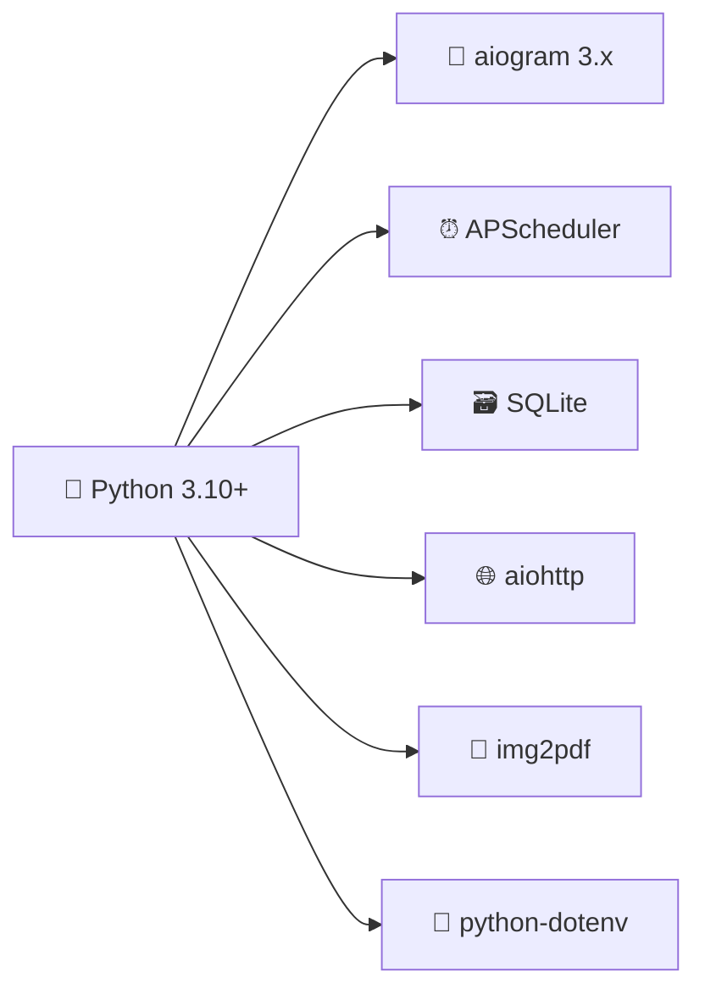

# 🌙 وَرْد — رفيقك الذكي للمحافظة على وردك اليومي من القرآن الكريم

<div align="center">

```
  _____                    _
 / ____|                  | |
| |     _ __ _____      __| | _____   __
| |    | '__/ _ \ \ /\ / /| |/ _ \ \ / /
| |____| | | (_) \ V  V / | | (_) \ V /
 \_____|_|  \___/ \_/\_/  |_|\___/ \_/
```

[](https://www.python.org/)
[](https://docs.aiogram.dev/)
[](https://www.sqlite.org/)
[](LICENSE)
[](https://github.com/0Ahmad0/quran_tele)

**بوت تيليجرام احترافي يُرسل لك وردك اليومي من القرآن الكريم تلقائيًا** ⏰📖

</div>

---

## ✨ لمحة عن المشروع

> في زحمة الحياة وكثرة المشاغل، قد ننسى وردنا أو نؤجله... فجاء هذا البوت ليكون **تذكيرًا لطيفًا** و**رفيقًا ثابتًا** يعينك على الاستمرار مع كتاب الله.

**وَرْد** ليس مجرد بوت — إنه **مُعينٌ على الثبات** مع كتاب الله تعالى، يُرسل لك صفحاتك اليومية في الوقت الذي تختاره، ويتتبع تقدمك حتى إتمام الختمة.

---

## 🚀 المميزات

<table>
<tr>
<td>

### 📖 إرسال تلقائي يومي
يصلك وردك في الوقت الذي تحدده دون أي تدخل يدوي

</td>
<td>

### ⏰ جدولة مرنة
حدد الوقت المناسب لك — صباحًا أو مساءً — والبوت يتكفل بالباقي

</td>
</tr>
<tr>
<td>

### 🔢 ورد يناسبك
اختر عدد الصفحات اليومية حسب طاقتك: صفحة واحدة أو أكثر

</td>
<td>

### 📍 متابعة ذكية للختمة
البوت يعرف آخر صفحة وصلت إليها ويكمل منها مباشرة

</td>
</tr>
<tr>
<td>

### 🖼 صور واضحة للصفحات
صفحات المصحف بجودة عالية للقراءة المريحة من داخل تيليجرام

</td>
<td>

### 📄 تحويل تلقائي لـ PDF
إذا كان الورد أكثر من 10 صفحات، يتم تجهيزه كملف PDF مرتب

</td>
</tr>
<tr>
<td>

### 🤲 أذكار وأدعية
احصل على دعاء مأثور أو ذكر في أي وقت بضغطة زر

</td>
<td>

### 🎉 تهنئة عند الختم
عند إتمام الختمة، يُهنئك البوت ويبدأ ختمة جديدة

</td>
</tr>
<tr>
<td>

### 🌐 دعم اللغتين
واجهة عربية وإنجليزية — اختر ما يناسبك

</td>
<td>

### 👑 لوحة تحكم للمدير
إحصائيات، بث عام، وإدارة المشتركين

</td>
</tr>
</table>

---

## 🛠 التقنيات المستخدمة



| التقنية | الوصف |
|---------|-------|
| **Python 3.10+** | لغة البرمجة الأساسية |
| **aiogram 3.x** | مكتبة تيليجرام غير المتزامنة |
| **APScheduler** | جدولة المهام وإرسال الورد اليومي |
| **SQLite** | قاعدة بيانات خفيفة لتخزين إعدادات المستخدمين |
| **aiohttp** | جلب صفحات المصحف من الإنترنت |
| **img2pdf** | تحويل صور الصفحات إلى ملف PDF |
| **python-dotenv** | إدارة المتغيرات البيئية بأمان |

---

## 📂 هيكل المشروع

```
quran_tele/
│
├── 📄 main.py              # نقطة البداية — معالجات أوامر البوت والجدولة
├── 📄 database.py          # مدير قاعدة بيانات SQLite
├── 📄 utils.py             # منطق الصفحات، توليد PDF، والأدعية
├── 📄 requirements.txt     # اعتماديات Python
├── 📄 .env.example         # مثال على المتغيرات البيئية
├── 📄 .gitignore           # الملفات المستبعدة من Git
├── 📄 README.md            # هذا الملف
└── 📄 DEPLOYMENT.md        # دليل النشر الكامل
```

---

## 🔐 الأمان أولاً

> ⚠️ **لا تضع التوكن في الكود أبدًا!**

يقرأ المشروع الأسرار من ملف `.env`:

```env
BOT_TOKEN=your_telegram_bot_token
ADMIN_ID=your_telegram_user_id
TIMEZONE=Africa/Cairo
```

إذا تم تسريب التوكن الخاص بك، قم بإلغائه فورًا من [@BotFather](https://t.me/BotFather) وتوليد توكن جديد.

---

## 🚀 التثبيت المحلي

### 1️⃣ استنساخ المستودع

```bash
git clone https://github.com/0Ahmad0/quran_tele.git
cd quran_tele
```

### 2️⃣ إنشاء بيئة افتراضية

```bash
python -m venv .venv
```

<details>
<summary><b>تفعيل البيئة — Windows</b></summary>

```powershell
.venv\Scripts\activate
```
</details>

<details>
<summary><b>تفعيل البيئة — Linux / macOS</b></summary>

```bash
source .venv/bin/activate
```
</details>

### 3️⃣ تثبيت الاعتماديات

```bash
pip install -r requirements.txt
```

### 4️⃣ إعداد ملف البيئة

```bash
# Linux / macOS
cp .env.example .env

# Windows PowerShell
Copy-Item .env.example .env
```

ثم عدّل ملف `.env` ببياناتك:

```env
BOT_TOKEN=put_your_new_bot_token_here
ADMIN_ID=123456789
TIMEZONE=Africa/Cairo
```

### 5️⃣ تشغيل البوت

```bash
python main.py
```

> ✅ عند التشغيل بنجاح، سيظهر لك: `Quran bot started`

---

## 📱 أوامر المستخدم

| الأمر | الوصف |
|-------|-------|
| `/start` | الاشتراك أو إعادة التفعيل |
| `/help` | عرض المساعدة |
| `/status` | عرض إعداداتك الحالية |
| `/goal 5` | ضبط عدد صفحات الورد اليومي |
| `/time 08:00` | ضبط وقت الإرسال |
| `/page 25` | ضبط الصفحة الحالية |
| `/send_now` | إرسال الورد الآن |
| `/azkar` | ذكر أو دعاء الآن |
| `/pause` | إيقاف مؤقت |
| `/resume` | استئناف الإرسال |

---

## 👑 أوامر المدير

> 🔒 متاحة فقط لحساب `ADMIN_ID`

| الأمر | الوصف |
|-------|-------|
| `/admin_stats` | عدد المشتركين النشطين |
| `/broadcast الرسالة` | إرسال رسالة لجميع المشتركين |
| `/admin_send_dua` | إرسال دعاء للجميع |
| `/set_khatma_count <id> <num>` | ضبط رقم الختمة لمستخدم |

---

## ⏰ منطق الجدولة

```
┌─────────────────────────────────────────────┐
│  كل 20 ثانية                                 │
│  ┌───────────────────────────────────────┐  │
│  │ هل حان وقت الإرسال لهذا المستخدم؟     │  │
│  │ ───────────────────────────────────── │  │
│  │ ✅ نعم ← إرسال الورد                  │  │
│  │ ❌ لا  ← تخطي                         │  │
│  └───────────────────────────────────────┘  │
└─────────────────────────────────────────────┘
```

البوت يفحص كل 20 ثانية المستخدمين الذين يحين وقت إرسالهم حسب `TIMEZONE` المحدد.

---

## 📖 منطق حساب الصفحات

```
المصحف = 604 صفحة

البداية ← من current_page
الإرسال ← daily_goal صفحة

إذا كانت الصفحات المتبقية ≤ (daily_goal × 1.5)
    ← إرسال كل الصفحات المتبقية (نهاية الختمة)
وإلا
    ← إرسال daily_goal صفحة فقط

بعد الختمة ← العودة للصفحة 1
```

---

## 📄 منطق الـ PDF

| عدد الصفحات | طريقة الإرسال |
|-------------|---------------|
| ≤ 10 صفحة | ألبوم صور داخل تيليجرام |
| > 10 صفحة | ملف PDF جاهز للتصفح |

يتم تنظيف الملفات المؤقتة تلقائيًا بعد الإرسال.

---

## ☁️ النشر على السحابة

للدليل الكامل، اقرأ [`DEPLOYMENT.md`](DEPLOYMENT.md)

### المنصات المدعومة

<div align="center">

| المنصة | النوع |
|--------|-------|
| 🟣 **Render** | Background Worker |
| 🔵 **Koyeb** | Docker / Python |
| 🟢 **Railway** | Python |
| 🖥 **VPS** | أي خادم Linux |

</div>

> ⚠️ **تنبيه SQLite:** بعض المنصات المجانية تحذف البيانات عند إعادة التشغيل. للإنتاج، استخدم PostgreSQL.

---

## 🛡 ملفات يجب ألا تُرفع على Git

```text
.env
quran_bot.db
tmp/
__pycache__/
*.pyc
```

جميعها مشمولة في `.gitignore`.

---

## 🤲 رسالة المطور

<div align="center">

> **تم تطوير هذا البوت بواسطة م.أحمد الحريري**
>
> بعناية واهتمام ليكون أداة نافعة لخدمة كتاب الله
> ومساعدة المسلمين على الثبات على الورد اليومي.
>
> نسأل الله أن يجعله **صدقة جارية**
> وأن ينفع به كل من استخدمه وشاركه.
>
> 🌿 *ابدأ الآن، واجعل القرآن رفيق يومك*

</div>

---

## 📜 الرخصة

هذا المشروع مفتوح المصدر. يمكنك استخدامه وتعديله للأغراض الشخصية والتعليمية.

---

<div align="center">

**⭐ إن أعجبك المشروع، لا تنسَ إعطاءه نجمة على GitHub**

[](https://github.com/0Ahmad0/quran_tele)
[](https://github.com/0Ahmad0/quran_tele)

</div>
